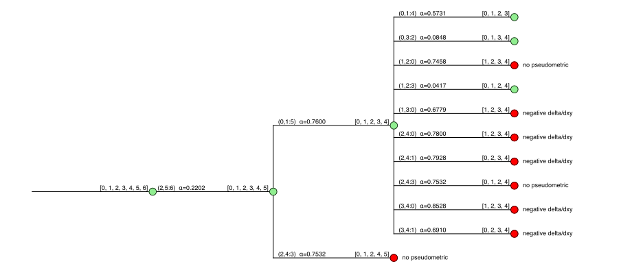
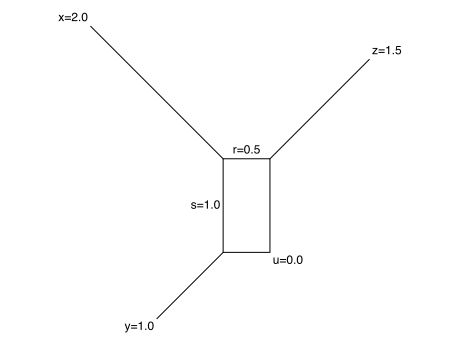

# Erdbeermet

A Python library for generating, visualizing, manipulating and recognizing type R (pseudo)metrics
(German: **Er**zeugung, **D**arstellung, **Be**arbeitung und **E**rkennung von **R**-(Pseudo)**Met**riken).

## Installation

Download or clone the repo, go to the root folder of package and install it using the command:

    python setup.py install

#### Dependencies

The package requires Python 3.7 or higher.

* [Numpy](https://numpy.org)
* [Scipy](http://www.scipy.org/install.html)
* [Matplotlib](https://matplotlib.org/)

## Usage and description

### Simulation

#### Background

R matrices are defined as distance matrices that can be obtained by repeated merge and branching events (see Prohaska et al. 2017 and the simulation steps below), the so-called  "R-steps".

The construction of any R matrix `D` starts with a single item (`0` in the simulation).
The second item (`1`) is always created by a pure branching event.
The construction then continues with a series of merge and branching events until `N` items have been created.

In the simulation, every such iteration is executed as follows (the distances are always updated symmetrically, i.e., such that `D[i, j] = D[j, i]`):

* with probability `branching_prob`, execute a pure branching event
    * choose `x` randomly among the existing items
    * create a new item `z` such that `D[u,z]=D[x,z]` for all previously created items `u` (in particular `D[x,z]=0.0`)
* otherwise, execute a merge event
    * choose parents `x` and `y` randomly (if `circular=True`, they must be neighbors in a circular order that is  maintained simultaneously to the simulation)
    * choose `alpha` from a uniform distribution on the interval (0, 1)
    * create a new item `z`
        * set `D[x, z] = (1 - alpha) * D[x, y]` and `D[y, z] = alpha * D[x, y]`
        * set `D[u, z] = alpha * D[x, u] + (1 - alpha) * D[y, u]` for all other previously created item `u`
        * if `circular=True`, insert `z` between `x` and `y` in the circular order
* for each item `p` created so far (including `z`), draw a distance increment `delta[p]` (here from an exponential distribution with rate parameter 1.0), if `clocklike=True` draw a common distance increment for all items
* set `D[p, q] = D[p, q] + delta[p] + delta[q]` for all pairs `p`, `q` of items

A simulation therefore can be stored as a `history` (see below), i.e., a `list` of the R-steps, each comprising a merge event of `x` and `y` that creates `z` with a parameter `alpha` (if `alpha` is 0 or 1, we have a pure branching event), and additionally a list of distance increments ("`delta`s") for the currently existing items.

A history written to file has one line per R-step of the form `(x, y: z) alpha; [deltas]`.

Example file: (Click to expand)

    (0, 0: 1) 1.0; [0.26,0.11]
    (1, 0: 2) 0.27; [0.004,0.18,0.2]
    (1, 2: 3) 0.61; [0.49,0.08,0.37,0.17]
    (0, 3: 4) 0.82; [0.21,0.06,0.03,0.42,0.02]
    (1, 4: 5) 0.81; [0.02,0.004,0.08,0.11,0.01,0.04]

#### The class `Scenario`

The module `erdbeermet.simulation` contains functions for simulating R matrices, writing simulated scenarios to file, and reloading them.
The class `Scenario` acts as a wrapper for histories of merge and branching events and the corresponding R matrix.

The class has the following attributes: (Click to expand)

| Attribute | Type | Description |
| --- | --- | --- |
| `N` | `int` | the number of items that were simulated |
| `history` | `list` of `tuple`s | the history of merge and branching events |
| `circular` | `bool` | indicates whether the scenario has a circular type R matrix |
| `D` | `N`x`N` `numpy` array | the distance matrix |

and the following functions: (Click to expand)

| Function | Parameter/return type | Description |
| --- | --- | --- |
| `distances()` | returns `N`x`N` `numpy` array | getter for the distance matrix |
| `get_history()` | returns `list` of `tuple`s | getter for the event history |
| `get_circular_order()` | returns `list` of `int`s | list representing the circular order (cut between item 0 and its predecessor); or `False` if the scenario is not circular |
| `write_history(filename)` | parameter of type `str` | write the event history into a file |
| `print_history()` |  | print the event history |

#### Generation of `Scenario`s

Instances of `Scenario` can be generated using the function `simulate()` in the module `erdbeermet.simulation`.

Parameters of this function (Click to expand)

| Parameter (with default values) | Type | Description |
| --- | --- | --- |
| `N` | `int` | number of items to be generated |
| `branching_prob=0.0` | `float` | probability that an event is a pure branching event; the default is 0.0, i.e., pure branching events are disabled |
| `circular=False` | `bool` | if set to True, the resulting distance matrix is guaranteed to be a circular type R matrix (only "neighbors" can be involves in merge events) |
| `clocklike=False` | `bool` | if set to True, the distance increment is equal for all items within each iteration (comprising a merge or branching event and the distance increments) and only varies between iteration; the default is False, in which case the increments are also drawn independently for the items within an iteration |

Simulated scenarios can be saved to a file (in form of their event history) using their function `write_history(filename)`.

    from erdbeermet.simulation import simulate, load

    # simulate a scenario with six items
    scenario = simulate(6, branching_prob=0.3, circular=True, clocklike=False)

    # print the individual R-steps
    scenario.print_history()

    # write history to file
    scenario.write_history('path/to/history.txt')

    # reload history to file
    scenario_reloaded = load('path/to/history.txt')

Alternatively, the function `load(filename, stop_after=False)` returns an instance of `Scenario` after reading an event history from an earlier simulated scenario from a file.
The parameter `stop_after` can be set to an `int` x>0 to only include the R-steps until the x'th item is created, i.e., x-1 R-steps are executed.

### Recognition

#### Background

Recognition of R matrices works by identifying a candidate for the last R-step `(x, y: z) alpha`, removing `z` from the distance matrix, and updating the distances according to specific rules.
This process is repeated until certain conditions are no longer satisfied (in which case the reconstruction path is not a valid reconstruction of the history) or until only 4 items remain.
A distance matrix on 4 items can be recognized as an R matrix using a specific formula.

A problem arises as there are often multiple candidates for the last R-step.
Multiple cases can occur for a specific candidate:
* it is the true last R-step
* it is one of the true last R-steps (that happened in different branches and did not take part in any merging event later)
* it is not an R-step that occurred in the "true" history but it admits the reconstruction of an alternative history that produces the same R matrix
* it is not an R-step that occurred in the "true" history and we will eventually hit a "dead end" if we choose this candidate no matter which candidate decisions we make later

The last point is critical since it implies that we have to try all candidates (unless we find more conditions to rule out candidates or a completely different algorithm).
Since this is true for every iteration, there is a possibly exponential number of reconstruction paths that have to be checked.
If a valid R matrix is given as input, at least one of these paths will return a successful reconstruction of a history that explains it.

The module `erdbeermet.recognition` currently follows this approach, i.e., it tries all possible candidates.
The overall recognition process can therefore be represented by a tree with the root representing the full input distance matrix and every vertex having one children per candidate R-step `(x, y: z) alpha`. Moreover, every such child is associated with the distance matrix obtained by removing the line and column corresponding to `z` and updating the remaining distances accordingly.
A vertex is a leaf when it has no valid candidate R-steps or none of them produces an updated distance matrix that still satisfies certain necessary conditions of R matrices (pseudometric, ...).
Also, vertices corresponding to 4x4 matrices are always leaves as, for them, it can be decided immediately whether or not they are R matrices.

#### Recognition trees

The function `recognize(D)` in the module `erdbeermet.recognition` takes a distance matrix `D` as input and returns the recognition tree as described in the previous section (instance of type `Tree` with attribute `root` of type `TreeNode`).

The tree nodes have the following attributes: (Click to expand)

| Attribute | Type | Description |
| --- | --- | --- |
| `parent` | `TreeNode` | the parent node (`None` for the root) |
| `children` | `list` of `TreeNode`s | child node (empty for the leaves) |
| `n` | `int` | the number of remaining items |
| `V` | `list` of `int`s | the list of remaining items |
| `D` | `n`x`n` `numpy` array | the distance matrix |
| `R_step` | `tuple` | the last R-steps that was identified and used to obtain `D` from the parents `n+1`x`n+1` matrix (order `x`, `y`, `z`, `alpha`); equals `None` for the root |
| `valid_ways` | `int` | total number of recognition paths leading to a success in the subtree below this node |
| `info` | `str` | info string why the recognition failed after the application of the R-step (if this is the case) |

The input distance matrix was an R matrix if `recognition_tree.root.valid_ways > 0` for the `recognition_tree` returned by the function `recognize(D)`.

This function has an optional parameter `first_candidate_only` (default `False`) which, when set to `True`, results in the algorithm only considering the first valid candidate R-step (that also produces a pseudometric and non-negative deltas) in every iteration.
As a consequence, the algorithm is guaranteed to finish in polynomial time. However, it may encounter a "dead end" even though the input was an R matrix.

The function also has an optional parameter `print_info` (default `False`). When it is set to `True`, information on the ongoing recognition is printed to the console.

There are several ways to output/analyze the result of a recognition, i.e., the recognition tree:

    from erdbeermet.simulation import simulate
    from erdbeermet.recognition import recognize

    # simulate scenario (alternatively load from file or create a custom distance matrix) and recognize
    scenario = simulate(6)
    recognition_tree = recognize(scenario.D, print_info=True)

    # write the recognition steps into a file
    recognition_tree.write_to_file('path/to/recognition.txt')

    # visualize the tree (and optionally save the graphic)
    recognition_tree.visualize(save_as='path/to/tree_visualization.pdf')

    # print a Newick representation
    recognition_tree.to_newick()

    # traverse the tree
    for node in recognition_tree.preorder():   # or postorder()
        # do something fancy with node
        pass

The visualization of a recognition tree looks as follows:

Red nodes indicate dead ends and subtrees without any successful recognition path.
In contrast, green leaves and inner nodes indicate metrics on 4 vertices that are R metrics and subtrees with at least one successful path, respectively.

### Box graphs

All (pseudo)metrics on four items can be represented by a "box graph".
The four items are the leaves, i.e., the vertices with degree one.
Their distances are given by the sum of edge lengths of any shortest path.

The sides of the rectangle are `r` and `s`. The "spikes" are the edges incident with the leaves `x`, `y`, `z`, and `u`.
Here, the spike of `u` has length 0.

The function `plot_box_graph` in the module `erdbeermet.visualize.BoxGraphVis` takes a distance matrix on four items as input and visualizes it as a box graph:

    from erdbeermet.simulation import simulate
    from erdbeermet.visualize.BoxGraphVis import plot_box_graph

    # simulate scenario on 4 items
    scenario = simulate(4)

    # plot box graph with custom leaf labels
    plot_box_graph(scenario.D, labels=['a', 'b', 'c', 'd'])

## References

What are R pseudometrics/matrices?

* **Prohaska, S.J., Berkemer, S.J., Gärtner, F., Gatter, T., Retzlaff, N., The Students of the Graphs and Biological Networks Lab 2017, Höner zu Siederdissen, C., Stadler, P.F. (2017) Expansion of gene clusters, circular orders, and the shortest Hamiltonian path problem. Journal of Mathematical Biology. doi: 10.1007/s00285-017-1197-3.**
